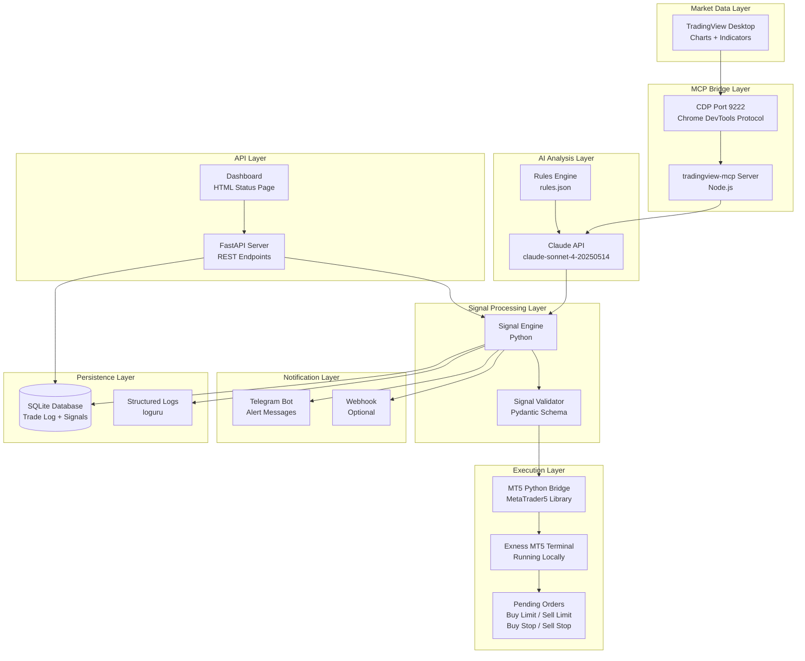

# MASTER_CONTEXT.md — Claude Trading Bot

> **Single Source of Truth** for the entire ClaudeTradingBot project.
> Last updated: 2026-06-02

---

## Table of Contents

1. [Project Overview](#1-project-overview)
2. [Architecture Diagram](#2-architecture-diagram)
3. [Tech Stack](#3-tech-stack)
4. [Project File Structure](#4-project-file-structure)
5. [Environment Variables](#5-environment-variables)
6. [Trading Strategy Logic](#6-trading-strategy-logic)
7. [MT5 Integration](#7-mt5-integration)
8. [Claude AI Integration](#8-claude-ai-integration)
9. [Signal Schema (Pydantic)](#9-signal-schema-pydantic)
10. [Risk Management Rules](#10-risk-management-rules)
11. [Notification System](#11-notification-system)
12. [Database Schema](#12-database-schema)
13. [API Endpoints (FastAPI)](#13-api-endpoints-fastapi)
14. [Configuration: rules.json](#14-configuration-rulesjson)
15. [MCP Setup Instructions](#15-mcp-setup-instructions)
16. [Copilot Instructions](#16-copilot-instructions)
17. [Security Checklist](#17-security-checklist)
18. [Testing Plan](#18-testing-plan)
19. [Roadmap & Future Features](#19-roadmap--future-features)

---

## 1. Project Overview

### What This System Does

ClaudeTradingBot is a locally-hosted, AI-powered trading system that combines:

- **TradingView Desktop** for live chart visualization and technical indicator data
- **Claude AI** (Anthropic API) as the reasoning and analysis engine
- **MetaTrader 5** (MT5) connected to an **Exness** broker account for trade execution

The system monitors multiple instruments (XAUUSD, BTCUSD, USDJPY, EURUSD, GBPUSD, NAS100, US30) across multiple timeframes, generates high-confidence trade signals using AI-driven chart analysis, and either alerts the user or automatically places pending orders on MT5.

### Who It's For

- Active retail traders who use TradingView for analysis and MT5/Exness for execution
- Traders who want AI-assisted decision-making without giving up control
- Scalpers (M1–M15) and swing traders (H1–D1) running the bot alongside their manual trading

### What Problem It Solves

1. **Analysis paralysis** — Claude processes multi-timeframe charts faster than a human, delivering structured setups with entry, SL, TP, and confidence level
2. **Missed entries** — Pending orders (buy limit / sell limit / buy stop / sell stop) are placed at optimal levels while the trader is away
3. **Emotional trading** — The rules engine enforces strict risk management: max 1–2% risk per trade, minimum R:R ratio, daily loss cap
4. **Fragmented workflow** — Unifies TradingView analysis, MT5 execution, Telegram alerts, and trade journaling into one system

### Two Operating Modes

| Mode | Behavior |
|------|----------|
| `SIGNAL_ONLY` | Analyzes charts, generates signals, sends Telegram alerts. No orders placed. |
| `AUTO_EXECUTE` | Does everything above PLUS places pending orders on MT5 automatically. |

---

## 2. Architecture Diagram



### Data Flow (Sequential)

1. **TradingView Desktop** runs with `--remote-debugging-port=9222`
2. **tradingview-mcp** Node.js server connects via CDP, exposing chart data as MCP tools
3. **Claude Code / Claude API** invokes MCP tools to read charts, indicators, watchlist
4. Claude reasons against **rules.json** to generate a structured trade signal (JSON)
5. **Signal Engine** validates the signal using the Pydantic schema
6. If `AUTO_EXECUTE` mode: **MT5 Bridge** places a pending order on Exness
7. **Notification Layer** sends a Telegram alert regardless of mode
8. **Database** logs the signal, execution result, and Claude's reasoning
9. **FastAPI** provides status/control endpoints accessible locally

---

## 3. Tech Stack

| Technology | Version | Purpose | Why Chosen |
|-----------|---------|---------|-----------|
| Python | 3.11+ | Core runtime for signal engine, MT5 bridge, API | Type hints, asyncio, match statements, ecosystem |
| MetaTrader5 (Python) | 5.0.45+ | Connect to Exness MT5 terminal programmatically | Official library, direct order placement, real-time data |
| FastAPI | 0.115+ | REST API for bot control and monitoring | Async-native, auto-docs, pydantic integration |
| Uvicorn | 0.32+ | ASGI server for FastAPI | Production-ready, fast, supports reload |
| Node.js | 20 LTS+ | Runs the tradingview-mcp server | Required by the MCP server package |
| tradingview-mcp | latest | MCP server bridging Claude ↔ TradingView via CDP | Only open-source solution for this integration |
| Claude API (Anthropic SDK) | 0.39+ | AI reasoning engine for chart analysis | Best-in-class reasoning, structured output, MCP support |
| SQLite | 3.40+ | Local database for trade log, signals, performance | Zero-config, file-based, perfect for local bot |
| SQLAlchemy | 2.0+ | ORM / query builder for database operations | Async support, type safety, migration-friendly |
| python-telegram-bot | 21+ | Send alert messages to Telegram | Async, well-maintained, full Bot API coverage |
| APScheduler | 3.10+ | Schedule periodic chart scans | Cron-like scheduling, async support, job persistence |
| Pydantic | 2.9+ | Data validation for signals and config | FastAPI-native, strict validation, JSON schema |
| python-dotenv | 1.0+ | Load environment variables from .env | Simple, standard, prevents credential leaks |
| Loguru | 0.7+ | Structured logging with rotation | Better than stdlib logging, zero-config, sinks |
| aiohttp | 3.10+ | Async HTTP client for external APIs | Non-blocking requests, session management |
| websockets | 13+ | WebSocket client (future: live streaming) | Standard async WS library |
| pytest | 8.3+ | Test framework | Industry standard, fixtures, async plugin |
| pytest-asyncio | 0.24+ | Async test support | Required for testing async code |

---

## 4. Project File Structure

```
ClaudeTradingBot/
├── .github/
│   └── copilot-instructions.md    # GitHub Copilot workspace instructions
├── core/
│   ├── __init__.py                # Package init
│   ├── signal_engine.py           # Orchestrates chart scan → signal generation → execution
│   ├── mt5_bridge.py              # MetaTrader5 connection, order placement, position management
│   ├── claude_client.py           # Anthropic API wrapper, prompt construction, response parsing
│   └── risk_manager.py            # Position sizing, daily loss tracking, RR validation
├── mcp/
│   ├── package.json               # Node.js dependencies for MCP server
│   ├── node_modules/              # (gitignored) installed npm packages
│   └── README.md                  # MCP-specific setup notes
├── strategies/
│   ├── __init__.py                # Package init
│   ├── scalping.py                # Scalping strategy logic (M1/M5/M15)
│   ├── swing.py                   # Swing trading strategy logic (H1/H4/D1)
│   └── rules.json                 # Trading rules configuration for Claude
├── notifications/
│   ├── __init__.py                # Package init
│   ├── telegram.py                # Telegram bot message formatting and sending
│   └── webhook.py                 # Generic webhook dispatcher (optional)
├── api/
│   ├── __init__.py                # Package init
│   ├── main.py                    # FastAPI app factory and startup
│   ├── routes.py                  # All API route handlers
│   └── schemas.py                 # Request/response Pydantic models for API
├── dashboard/
│   ├── index.html                 # Simple status page (bot state, recent signals)
│   └── static/                    # CSS/JS assets
├── logs/
│   └── .gitkeep                   # Logs directory (contents gitignored)
├── tests/
│   ├── __init__.py                # Package init
│   ├── test_signal_engine.py      # Unit tests for signal generation
│   ├── test_mt5_bridge.py         # MT5 mock tests (paper trading)
│   ├── test_claude_client.py      # Claude response parsing tests
│   ├── test_risk_manager.py       # Position sizing tests
│   └── conftest.py                # Shared fixtures
├── docs/
│   ├── claude_tradingview_mcp_reference.md  # MCP setup reference (from PDF)
│   └── trading_rules_explained.md           # Strategy documentation
├── .env.example                   # Environment variable template
├── .env                           # (gitignored) actual credentials
├── .gitignore                     # Git ignore rules
├── requirements.txt               # Python dependencies
├── package.json                   # Root Node.js package (MCP scripts)
├── main.py                        # Application entry point
├── README.md                      # Project README
├── MASTER_CONTEXT.md              # This file — single source of truth
└── database.db                    # (gitignored) SQLite database file
```

### Key File Responsibilities

| File | Responsibility |
|------|---------------|
| `main.py` | Entry point — starts FastAPI server, initializes MT5, schedules scans |
| `core/signal_engine.py` | Coordinates: ask Claude → validate signal → risk check → execute/alert |
| `core/mt5_bridge.py` | All MT5 operations: connect, order placement, position queries |
| `core/claude_client.py` | Builds prompts, calls Anthropic API, parses JSON responses |
| `core/risk_manager.py` | Calculates lot size, checks daily P&L, enforces rules |
| `strategies/rules.json` | Claude's reference config — watchlist, indicators, bias criteria |
| `notifications/telegram.py` | Formats and sends Telegram signal alerts |
| `api/routes.py` | REST endpoints for bot control |

---

## 5. Environment Variables

```bash
# ═══════════════════════════════════════════════════════════
# ClaudeTradingBot Environment Configuration
# Copy this file to .env and fill in your actual values
# ═══════════════════════════════════════════════════════════

# ─── AI CONFIGURATION ─────────────────────────────────────
# Your Anthropic API key (starts with sk-ant-)
ANTHROPIC_API_KEY=sk-ant-api03-your-key-here

# Claude model to use for analysis
CLAUDE_MODEL=claude-sonnet-4-20250514

# ─── MT5 / EXNESS CONFIGURATION ──────────────────────────
# Your Exness MT5 account number
MT5_LOGIN=12345678

# MT5 account password (investor or master password)
MT5_PASSWORD=your_mt5_password_here

# Exness MT5 server name (find in MT5 terminal → File → Login)
MT5_SERVER=Exness-MT5Real

# Path to MT5 terminal (auto-detected if empty)
MT5_PATH=

# ─── TELEGRAM NOTIFICATIONS ──────────────────────────────
# Bot token from @BotFather
TELEGRAM_BOT_TOKEN=123456789:ABCDefGHIJKLMnopQRSTUvwxyz

# Chat ID to send alerts to (use @userinfobot to find yours)
TELEGRAM_CHAT_ID=-1001234567890

# ─── TRADINGVIEW / MCP ────────────────────────────────────
# CDP port for TradingView Desktop debug connection
TRADINGVIEW_CDP_PORT=9222

# Path to tradingview-mcp server directory
MCP_SERVER_PATH=~/tradingview-mcp

# ─── BOT CONFIGURATION ───────────────────────────────────
# Operating mode: SIGNAL_ONLY or AUTO_EXECUTE
BOT_MODE=SIGNAL_ONLY

# Risk percentage per trade (1.0 = 1% of account equity)
RISK_PER_TRADE_PCT=1.0

# Default reward-to-risk ratio (minimum enforced)
DEFAULT_RR_RATIO=2.0

# Maximum concurrent positions across all pairs
MAX_TOTAL_POSITIONS=5

# Maximum positions per single instrument
MAX_POSITIONS_PER_PAIR=1

# Maximum daily loss percentage before bot auto-pauses (3.0 = 3%)
MAX_DAILY_LOSS_PCT=3.0

# ─── DATABASE ─────────────────────────────────────────────
# SQLite connection string (relative to project root)
DATABASE_URL=sqlite:///database.db

# ─── LOGGING ──────────────────────────────────────────────
# Log level: DEBUG, INFO, WARNING, ERROR, CRITICAL
LOG_LEVEL=INFO

# Log file rotation size
LOG_ROTATION=10 MB

# Log retention period
LOG_RETENTION=30 days
```

---

## 6. Trading Strategy Logic

### 6.1 SCALPING Strategy (M1 / M5 / M15)

#### Applicable Instruments
- XAUUSD (Gold)
- EURUSD, GBPUSD, USDJPY (Major Forex)
- NAS100, US30 (Indices during NY session only)

#### Entry Logic

A scalp BUY signal is generated when ALL conditions are met:

1. **EMA Crossover**: EMA 9 crosses ABOVE EMA 21 on M5
2. **RSI Confirmation**: RSI(14) is between 40–65 (not overbought)
3. **Support Level**: Price is within 10 pips of a recent M15 support zone
4. **Trend Alignment**: Price is above EMA 50 on M15 (higher timeframe trend)
5. **Spread Filter**: Current spread ≤ max allowed spread for instrument (see rules.json)
6. **Session Filter**: Must be within London (07:00–16:00 UTC) or New York (13:00–21:00 UTC) session for forex pairs

A scalp SELL signal is generated when ALL conditions are met:

1. **EMA Crossover**: EMA 9 crosses BELOW EMA 21 on M5
2. **RSI Confirmation**: RSI(14) is between 35–60 (not oversold)
3. **Resistance Level**: Price is within 10 pips of a recent M15 resistance zone
4. **Trend Alignment**: Price is below EMA 50 on M15
5. **Spread Filter**: Current spread ≤ max allowed spread
6. **Session Filter**: Within active session

#### Exit Logic

| Method | Description |
|--------|-------------|
| **Fixed Pips** | TP at 10–20 pips for forex, 50–100 pips for XAUUSD, 150–300 points for indices |
| **ATR-Based** | TP = 1.5 × ATR(14) on entry timeframe; SL = 1.0 × ATR(14) |
| **Trailing Stop** | After reaching 1R profit, trail stop to breakeven; after 1.5R, trail by 0.5R increments |

#### Order Types Used
- **Buy Limit**: When price is at support and expected to bounce
- **Sell Limit**: When price is at resistance and expected to reject
- **Buy Stop**: When price breaks above key resistance (breakout entry)
- **Sell Stop**: When price breaks below key support (breakdown entry)

#### Constraints
- Maximum 3 open scalp positions at any time
- No scalping within 30 minutes of high-impact news
- No scalping during thin liquidity (22:00–01:00 UTC)
- Minimum distance from current price for pending orders: 5 pips (forex), 50 points (indices), 0.50 (XAUUSD)

---

### 6.2 SWING Strategy (H1 / H4 / D1)

#### Applicable Instruments
- All monitored pairs: XAUUSD, BTCUSD, USDJPY, EURUSD, GBPUSD, NAS100, US30

#### Entry Logic

A swing BUY signal is generated when ALL conditions are met:

1. **Structure Break**: Price creates a higher high on H4/D1 (break of structure to the upside)
2. **EMA Position**: Price is above 50 EMA AND 50 EMA is above 200 EMA on D1
3. **RSI Confirmation**: RSI(14) between 45–70 on the entry timeframe (H4)
4. **Pullback Zone**: Price has pulled back to 50 EMA or 61.8% Fibonacci retracement of the last impulse leg
5. **Volume Confirmation**: Volume on the breakout candle is above 20-period average

A swing SELL signal is generated when ALL conditions are met:

1. **Structure Break**: Price creates a lower low on H4/D1 (break of structure to the downside)
2. **EMA Position**: Price is below 50 EMA AND 50 EMA is below 200 EMA on D1
3. **RSI Confirmation**: RSI(14) between 30–55 on the entry timeframe (H4)
4. **Pullback Zone**: Price has pulled back to 50 EMA or 38.2% Fibonacci retracement of the last impulse leg
5. **Volume Confirmation**: Volume on the breakdown candle is above 20-period average

#### Entry Types

| Scenario | Order Type | Placement |
|----------|-----------|-----------|
| Bullish pullback to EMA/fib support | Buy Limit | At the pullback zone (50 EMA or 61.8% fib) |
| Bearish pullback to EMA/fib resistance | Sell Limit | At the pullback zone (50 EMA or 38.2% fib) |
| Bullish breakout above resistance | Buy Stop | 5 pips above the broken structure level |
| Bearish breakdown below support | Sell Stop | 5 pips below the broken structure level |

#### TP/SL Placement Rules

| Level | Calculation |
|-------|-------------|
| **SL (Stop Loss)** | Below the last swing low (BUY) or above last swing high (SELL), plus 1 ATR(14) buffer on D1 |
| **TP1 (Take Profit 1)** | 1:1 R:R from entry (partial close: 50% of position) |
| **TP2 (Take Profit 2)** | 2:1 R:R or next major structure level (close remaining 50%) |
| **Breakeven** | Move SL to entry after TP1 is hit |

#### News Filter (NO TRADES)
- 30 minutes before and 30 minutes after any of:
  - US CPI (Consumer Price Index)
  - FOMC Interest Rate Decision
  - US Non-Farm Payrolls (NFP)
  - ECB Rate Decision
  - US GDP
  - US PCE (Personal Consumption Expenditure)

#### Constraints
- Maximum 2 open swing positions per instrument
- Maximum 5 swing positions total
- No new swing entries on Friday after 20:00 UTC (weekend gap risk)
- BTCUSD: trade 24/7 but reduce size by 50% during weekends

---

## 7. MT5 Integration

### Connection Flow

```python
import MetaTrader5 as mt5

# Step 1: Initialize the MT5 terminal connection
if not mt5.initialize(path=MT5_PATH):  # path optional if default install
    raise ConnectionError(f"MT5 initialize failed: {mt5.last_error()}")

# Step 2: Login to Exness account
authorized = mt5.login(
    login=int(MT5_LOGIN),
    password=MT5_PASSWORD,
    server=MT5_SERVER
)
if not authorized:
    raise ConnectionError(f"MT5 login failed: {mt5.last_error()}")

# Step 3: Verify connection
account_info = mt5.account_info()
print(f"Connected: {account_info.login} | Balance: {account_info.balance}")
```

### Key Functions

#### `mt5.symbol_info(symbol)`
Returns symbol properties (spread, digits, trade sizes, etc.)

```python
info = mt5.symbol_info("XAUUSD")
if info is None:
    raise ValueError(f"Symbol XAUUSD not found")
if not info.visible:
    mt5.symbol_select("XAUUSD", True)  # Add to Market Watch

spread_points = info.spread  # Current spread in points
min_lot = info.volume_min    # Minimum lot size (e.g., 0.01)
max_lot = info.volume_max    # Maximum lot size
lot_step = info.volume_step  # Lot size increment
point = info.point           # Point value (e.g., 0.01 for XAUUSD)
```

#### `mt5.order_send(request)`
Places an order. Returns an `OrderSendResult`.

```python
request = {
    "action": mt5.TRADE_ACTION_PENDING,
    "symbol": "XAUUSD",
    "volume": 0.10,
    "type": mt5.ORDER_TYPE_BUY_LIMIT,
    "price": 2350.00,
    "sl": 2340.00,
    "tp": 2370.00,
    "deviation": 20,
    "magic": 234000,      # Magic number to identify bot orders
    "comment": "CTB_SWING_BUY",
    "type_time": mt5.ORDER_TIME_GTC,  # Good Till Cancelled
    "type_filling": mt5.ORDER_FILLING_IOC,
}

result = mt5.order_send(request)
if result.retcode != mt5.TRADE_RETCODE_DONE:
    handle_mt5_error(result.retcode, result.comment)
else:
    log_execution(result.order, request)
```

#### Order Types

| Constant | Value | Description |
|----------|-------|-------------|
| `ORDER_TYPE_BUY_LIMIT` | 2 | Buy at specified price or lower |
| `ORDER_TYPE_SELL_LIMIT` | 3 | Sell at specified price or higher |
| `ORDER_TYPE_BUY_STOP` | 4 | Buy at specified price or higher (breakout) |
| `ORDER_TYPE_SELL_STOP` | 5 | Sell at specified price or lower (breakdown) |

#### `mt5.positions_get()`
Returns all open positions.

```python
positions = mt5.positions_get(symbol="XAUUSD")
if positions:
    for pos in positions:
        print(f"Ticket: {pos.ticket}, Type: {pos.type}, Volume: {pos.volume}, Profit: {pos.profit}")
```

#### `mt5.history_deals_get(from_date, to_date)`
Returns historical deals for performance tracking.

```python
from datetime import datetime, timedelta

today = datetime.now()
deals = mt5.history_deals_get(today - timedelta(days=1), today)
if deals:
    total_profit = sum(d.profit for d in deals if d.magic == 234000)
```

### MT5 Error Handling

| Return Code | Constant | Meaning | Action |
|-------------|----------|---------|--------|
| 10009 | `TRADE_RETCODE_DONE` | Order placed successfully | Log success |
| 10004 | `TRADE_RETCODE_REQUOTE` | Price changed | Retry with new price |
| 10006 | `TRADE_RETCODE_REJECT` | Request rejected | Log, alert, do not retry |
| 10007 | `TRADE_RETCODE_CANCEL` | Cancelled by trader | Log, no action |
| 10010 | `TRADE_RETCODE_DONE_PARTIAL` | Partially filled | Log, track remaining |
| 10013 | `TRADE_RETCODE_INVALID_STOPS` | Invalid SL/TP | Recalculate stops with min distance |
| 10014 | `TRADE_RETCODE_INVALID_VOLUME` | Invalid lot size | Adjust to valid lot step |
| 10015 | `TRADE_RETCODE_INVALID_PRICE` | Invalid price | Refresh price, retry |
| 10016 | `TRADE_RETCODE_INVALID_FILL` | Unsupported filling mode | Try ORDER_FILLING_IOC or ORDER_FILLING_RETURN |
| 10019 | `TRADE_RETCODE_NO_MONEY` | Insufficient margin | Alert trader, skip signal |

```python
def handle_mt5_error(retcode: int, comment: str) -> None:
    """Handle MT5 order_send errors with appropriate responses."""
    retriable = {10004, 10015}  # Requote, invalid price
    critical = {10006, 10019}   # Reject, no money

    if retcode in retriable:
        logger.warning(f"MT5 retriable error {retcode}: {comment}")
        # Retry logic with backoff
    elif retcode in critical:
        logger.error(f"MT5 critical error {retcode}: {comment}")
        # Alert via Telegram, do not retry
    else:
        logger.error(f"MT5 error {retcode}: {comment}")
```

---

## 8. Claude AI Integration

### How Claude Reads TradingView via MCP

The integration follows the architecture from the "Claude x TradingView" reference by @ishaan_576:

1. **TradingView Desktop** launches with `--remote-debugging-port=9222`
2. The **tradingview-mcp** Node.js server connects to TradingView via Chrome DevTools Protocol (CDP)
3. Claude Code (or our Python bot via the Anthropic API) uses MCP tools to:
   - Read current chart (price, timeframe, symbol)
   - Pull indicator values (RSI, MACD, EMA positions)
   - Scan the watchlist
   - Get chart annotations and drawn levels

### MCP Tools Available

Once connected, Claude has access to these MCP tools (provided by tradingview-mcp):

| Tool | What It Does |
|------|-------------|
| `tv_health_check` | Verify CDP connection is active |
| `tv_get_chart` | Read the currently displayed chart (symbol, timeframe, OHLCV) |
| `tv_get_indicators` | Pull indicator values from the active chart |
| `tv_scan_watchlist` | Scan all pairs in the configured watchlist |
| `tv_launch` | Launch TradingView Desktop with debug port |

### Claude API Call Structure

```python
import anthropic

client = anthropic.Anthropic(api_key=ANTHROPIC_API_KEY)

# System prompt establishes Claude's role and output format
system_prompt = """You are an expert trading analyst. You analyze charts using 
technical analysis and generate structured trade signals.

RULES:
- Always respond with valid JSON matching the TradeSignal schema
- Never recommend market orders — only pending orders (buy limit, sell limit, buy stop, sell stop)
- Enforce minimum 2:1 reward-to-risk ratio
- State your confidence as a percentage (0-100)
- Provide clear reasoning for every signal

OUTPUT FORMAT:
{
  "pair": "XAUUSD",
  "direction": "BUY",
  "order_type": "BUY_LIMIT",
  "entry_price": 2350.00,
  "stop_loss": 2340.00,
  "take_profit_1": 2360.00,
  "take_profit_2": 2370.00,
  "timeframe": "H4",
  "strategy": "SWING",
  "confidence": 78,
  "reasoning": "Price pulled back to 50 EMA on H4 after structure break..."
}

If no valid setup exists, respond with:
{"signal": "NO_TRADE", "reasoning": "explanation"}
"""

# User prompt includes the chart data from MCP
user_prompt = f"""Analyze {pair} on {timeframe} timeframe.

Current chart data:
- Price: {current_price}
- RSI(14): {rsi_value}
- MACD: {macd_line} / Signal: {signal_line} / Histogram: {histogram}
- EMA 50: {ema_50}
- EMA 200: {ema_200}
- Recent structure: {structure_description}
- Support levels: {support_levels}
- Resistance levels: {resistance_levels}
- Current spread: {spread} points

Trading rules (from rules.json):
{json.dumps(rules, indent=2)}

Generate a trade signal or NO_TRADE with reasoning."""

response = client.messages.create(
    model="claude-sonnet-4-20250514",
    max_tokens=1000,
    system=system_prompt,
    messages=[{"role": "user", "content": user_prompt}]
)

signal_json = json.loads(response.content[0].text)
```

### Response Parsing

Claude's response is parsed into a validated `TradeSignal` Pydantic model. If parsing fails, the signal is logged as invalid and discarded.

---

## 9. Signal Schema (Pydantic)

```python
from pydantic import BaseModel, Field, field_validator
from typing import Literal, Optional
from datetime import datetime
from enum import Enum


class Direction(str, Enum):
    BUY = "BUY"
    SELL = "SELL"


class OrderType(str, Enum):
    BUY_LIMIT = "BUY_LIMIT"
    SELL_LIMIT = "SELL_LIMIT"
    BUY_STOP = "BUY_STOP"
    SELL_STOP = "SELL_STOP"


class Strategy(str, Enum):
    SCALPING = "SCALPING"
    SWING = "SWING"


class Timeframe(str, Enum):
    M1 = "M1"
    M5 = "M5"
    M15 = "M15"
    H1 = "H1"
    H4 = "H4"
    D1 = "D1"


class TradeSignal(BaseModel):
    """Validated trade signal from Claude AI analysis."""

    pair: str = Field(..., description="Trading instrument symbol", examples=["XAUUSD", "EURUSD"])
    direction: Direction = Field(..., description="Trade direction")
    order_type: OrderType = Field(..., description="Pending order type")
    entry_price: float = Field(..., gt=0, description="Entry price for pending order")
    stop_loss: float = Field(..., gt=0, description="Stop loss price")
    take_profit_1: float = Field(..., gt=0, description="First take profit target")
    take_profit_2: Optional[float] = Field(None, gt=0, description="Second take profit target")
    timeframe: Timeframe = Field(..., description="Analysis timeframe")
    strategy: Strategy = Field(..., description="Strategy type used")
    confidence: int = Field(..., ge=0, le=100, description="Signal confidence percentage")
    reasoning: str = Field(..., min_length=20, description="Claude's analysis reasoning")
    timestamp: datetime = Field(default_factory=datetime.utcnow)
    signal_id: Optional[str] = Field(None, description="Unique signal identifier")

    @field_validator("confidence")
    @classmethod
    def confidence_must_be_actionable(cls, v: int) -> int:
        if v < 60:
            raise ValueError("Confidence below 60% is not actionable")
        return v

    @field_validator("stop_loss")
    @classmethod
    def stop_loss_must_be_valid(cls, v: float, info) -> float:
        data = info.data
        if "direction" in data and "entry_price" in data:
            if data["direction"] == Direction.BUY and v >= data["entry_price"]:
                raise ValueError("BUY signal: stop_loss must be below entry_price")
            if data["direction"] == Direction.SELL and v <= data["entry_price"]:
                raise ValueError("SELL signal: stop_loss must be above entry_price")
        return v

    @field_validator("take_profit_1")
    @classmethod
    def tp1_must_be_valid(cls, v: float, info) -> float:
        data = info.data
        if "direction" in data and "entry_price" in data:
            if data["direction"] == Direction.BUY and v <= data["entry_price"]:
                raise ValueError("BUY signal: take_profit_1 must be above entry_price")
            if data["direction"] == Direction.SELL and v >= data["entry_price"]:
                raise ValueError("SELL signal: take_profit_1 must be below entry_price")
        return v

    @property
    def risk_reward_ratio(self) -> float:
        risk = abs(self.entry_price - self.stop_loss)
        reward = abs(self.take_profit_1 - self.entry_price)
        return round(reward / risk, 2) if risk > 0 else 0.0

    @property
    def risk_pips(self) -> float:
        return abs(self.entry_price - self.stop_loss)


class NoTradeSignal(BaseModel):
    """Response when no valid trade setup is found."""
    signal: Literal["NO_TRADE"] = "NO_TRADE"
    reasoning: str = Field(..., min_length=10)
    timestamp: datetime = Field(default_factory=datetime.utcnow)
```

### Example JSON (Valid Signal)

```json
{
  "pair": "XAUUSD",
  "direction": "BUY",
  "order_type": "BUY_LIMIT",
  "entry_price": 2350.00,
  "stop_loss": 2340.00,
  "take_profit_1": 2370.00,
  "take_profit_2": 2390.00,
  "timeframe": "H4",
  "strategy": "SWING",
  "confidence": 78,
  "reasoning": "XAUUSD has pulled back to the 50 EMA on H4 after a clear break of structure above 2355. RSI(14) is at 52, confirming momentum is not exhausted. The 2350 level aligns with the 61.8% Fibonacci retracement of the last impulse from 2330 to 2380. Placing buy limit at 2350 with SL below the swing low at 2340. TP1 at 2370 (2:1 RR) and TP2 at the previous high 2390.",
  "timestamp": "2026-06-02T09:30:00Z"
}
```

---

## 10. Risk Management Rules

### Position Sizing Formula

```
lot_size = (account_equity × risk_percent / 100) / (sl_distance_points × point_value_per_lot)
```

Where:
- `account_equity` = Current account equity from MT5
- `risk_percent` = From RISK_PER_TRADE_PCT (default 1.0%)
- `sl_distance_points` = |entry_price - stop_loss| / point
- `point_value_per_lot` = Contract size × point (varies by instrument)

#### Example Calculation (XAUUSD)

```
Account equity: $10,000
Risk per trade: 1% = $100
Entry: 2350.00, SL: 2340.00
SL distance: 10.00 (1000 points, point = 0.01)
Point value per lot (XAUUSD): $1 per point per lot (100 oz × $0.01)
Lot size = $100 / (1000 × $0.01 × 100) = $100 / $1000 = 0.10 lots
```

### Risk Rules

| Rule | Setting | Description |
|------|---------|-------------|
| Max risk per trade | 1% (configurable) | Never risk more than this % of equity on one trade |
| Minimum R:R ratio | 2.0 (configurable) | Signal rejected if TP1/SL ratio < this value |
| Max positions per pair | 1 (scalp), 2 (swing) | Prevents over-concentration |
| Max total positions | 5 | Hard cap on open positions |
| Max daily loss | 3% of equity | Bot auto-pauses if breached |
| Spread cap | Per-instrument (see below) | Signal rejected if spread exceeds cap |

### Spread Caps (Exness Typical)

| Instrument | Max Spread (points) | Approx. Pips |
|-----------|-------------------|-------------|
| XAUUSD | 30 | 3.0 |
| BTCUSD | 5000 | 50.0 |
| EURUSD | 15 | 1.5 |
| GBPUSD | 18 | 1.8 |
| USDJPY | 15 | 1.5 |
| NAS100 | 200 | 20.0 |
| US30 | 300 | 30.0 |

### Daily Loss Auto-Pause Logic

```python
def check_daily_loss(account_equity: float, daily_start_equity: float) -> bool:
    """Returns True if daily loss limit is breached."""
    current_loss_pct = ((daily_start_equity - account_equity) / daily_start_equity) * 100
    if current_loss_pct >= MAX_DAILY_LOSS_PCT:
        logger.critical(f"Daily loss limit breached: {current_loss_pct:.2f}%")
        pause_bot()
        send_telegram_alert("⚠️ BOT PAUSED: Daily loss limit reached")
        return True
    return False
```

---

## 11. Notification System

### Telegram Alert Format

#### BUY Signal Alert

```
🟢 BUY SIGNAL — XAUUSD

📊 Strategy: SWING | Timeframe: H4
📈 Direction: BUY LIMIT

💰 Entry: 2350.00
🛑 Stop Loss: 2340.00
🎯 TP1: 2370.00
🎯 TP2: 2390.00

⚖️ Risk:Reward = 1:2.0
📏 Risk: 100 pips ($100)
🎲 Confidence: 78%

💡 Reasoning:
Price pulled back to 50 EMA on H4 after structure break.
RSI at 52 confirms momentum. 2350 aligns with 61.8% fib.

🤖 Mode: ✅ EXECUTING
📋 Order #: 12345678
⏰ 2026-06-02 09:30 UTC
```

#### SELL Signal Alert

```
🔴 SELL SIGNAL — EURUSD

📊 Strategy: SCALPING | Timeframe: M5
📉 Direction: SELL LIMIT

💰 Entry: 1.08500
🛑 Stop Loss: 1.08650
🎯 TP1: 1.08200
🎯 TP2: —

⚖️ Risk:Reward = 1:2.0
📏 Risk: 15 pips ($15)
🎲 Confidence: 72%

💡 Reasoning:
EMA 9 crossed below EMA 21 on M5. Price approaching
M15 resistance at 1.0850. RSI at 58, room to fall.

🤖 Mode: 📡 SIGNAL ONLY
⏰ 2026-06-02 14:15 UTC
```

### Implementation

```python
async def send_signal_alert(signal: TradeSignal, execution_result: dict | None) -> None:
    """Format and send a trade signal alert via Telegram."""
    emoji_dir = "🟢" if signal.direction == Direction.BUY else "🔴"
    dir_label = "BUY" if signal.direction == Direction.BUY else "SELL"
    arrow = "📈" if signal.direction == Direction.BUY else "📉"

    mode_tag = "✅ EXECUTING" if BOT_MODE == "AUTO_EXECUTE" else "📡 SIGNAL ONLY"
    order_line = ""
    if execution_result and execution_result.get("order_id"):
        order_line = f"\n📋 Order #: {execution_result['order_id']}"

    tp2_line = f"\n🎯 TP2: {signal.take_profit_2}" if signal.take_profit_2 else "\n🎯 TP2: —"

    message = (
        f"{emoji_dir} {dir_label} SIGNAL — {signal.pair}\n\n"
        f"📊 Strategy: {signal.strategy.value} | Timeframe: {signal.timeframe.value}\n"
        f"{arrow} Direction: {signal.order_type.value}\n\n"
        f"💰 Entry: {signal.entry_price}\n"
        f"🛑 Stop Loss: {signal.stop_loss}\n"
        f"🎯 TP1: {signal.take_profit_1}"
        f"{tp2_line}\n\n"
        f"⚖️ Risk:Reward = 1:{signal.risk_reward_ratio}\n"
        f"📏 Risk: {signal.risk_pips:.1f} pips\n"
        f"🎲 Confidence: {signal.confidence}%\n\n"
        f"💡 Reasoning:\n{signal.reasoning[:200]}\n\n"
        f"🤖 Mode: {mode_tag}{order_line}\n"
        f"⏰ {signal.timestamp.strftime('%Y-%m-%d %H:%M')} UTC"
    )

    await telegram_bot.send_message(chat_id=TELEGRAM_CHAT_ID, text=message)
```

---

## 12. Database Schema

### SQLite Tables

#### `trade_signals` — All signals received from Claude

```sql
CREATE TABLE trade_signals (
    id INTEGER PRIMARY KEY AUTOINCREMENT,
    signal_id TEXT UNIQUE NOT NULL,
    pair TEXT NOT NULL,
    direction TEXT NOT NULL CHECK(direction IN ('BUY', 'SELL')),
    order_type TEXT NOT NULL CHECK(order_type IN ('BUY_LIMIT', 'SELL_LIMIT', 'BUY_STOP', 'SELL_STOP')),
    entry_price REAL NOT NULL,
    stop_loss REAL NOT NULL,
    take_profit_1 REAL NOT NULL,
    take_profit_2 REAL,
    timeframe TEXT NOT NULL,
    strategy TEXT NOT NULL CHECK(strategy IN ('SCALPING', 'SWING')),
    confidence INTEGER NOT NULL,
    reasoning TEXT NOT NULL,
    risk_reward_ratio REAL NOT NULL,
    was_executed INTEGER NOT NULL DEFAULT 0,
    created_at TIMESTAMP NOT NULL DEFAULT CURRENT_TIMESTAMP
);
```

#### `executed_trades` — All MT5 orders placed

```sql
CREATE TABLE executed_trades (
    id INTEGER PRIMARY KEY AUTOINCREMENT,
    signal_id TEXT NOT NULL REFERENCES trade_signals(signal_id),
    mt5_order_id INTEGER NOT NULL,
    mt5_ticket INTEGER,
    pair TEXT NOT NULL,
    direction TEXT NOT NULL,
    order_type TEXT NOT NULL,
    volume REAL NOT NULL,
    entry_price REAL NOT NULL,
    stop_loss REAL NOT NULL,
    take_profit_1 REAL NOT NULL,
    take_profit_2 REAL,
    status TEXT NOT NULL DEFAULT 'PENDING' CHECK(status IN ('PENDING', 'FILLED', 'CANCELLED', 'EXPIRED', 'ERROR')),
    mt5_retcode INTEGER,
    mt5_comment TEXT,
    profit REAL DEFAULT 0.0,
    closed_at TIMESTAMP,
    created_at TIMESTAMP NOT NULL DEFAULT CURRENT_TIMESTAMP,
    updated_at TIMESTAMP NOT NULL DEFAULT CURRENT_TIMESTAMP
);
```

#### `bot_log` — System events

```sql
CREATE TABLE bot_log (
    id INTEGER PRIMARY KEY AUTOINCREMENT,
    level TEXT NOT NULL CHECK(level IN ('DEBUG', 'INFO', 'WARNING', 'ERROR', 'CRITICAL')),
    component TEXT NOT NULL,
    message TEXT NOT NULL,
    details TEXT,
    created_at TIMESTAMP NOT NULL DEFAULT CURRENT_TIMESTAMP
);
```

#### `performance_summary` — Daily P&L and metrics

```sql
CREATE TABLE performance_summary (
    id INTEGER PRIMARY KEY AUTOINCREMENT,
    date TEXT NOT NULL UNIQUE,
    total_signals INTEGER NOT NULL DEFAULT 0,
    executed_trades INTEGER NOT NULL DEFAULT 0,
    winning_trades INTEGER NOT NULL DEFAULT 0,
    losing_trades INTEGER NOT NULL DEFAULT 0,
    total_profit REAL NOT NULL DEFAULT 0.0,
    total_loss REAL NOT NULL DEFAULT 0.0,
    net_pnl REAL NOT NULL DEFAULT 0.0,
    win_rate REAL NOT NULL DEFAULT 0.0,
    max_drawdown REAL NOT NULL DEFAULT 0.0,
    starting_equity REAL NOT NULL,
    ending_equity REAL NOT NULL,
    created_at TIMESTAMP NOT NULL DEFAULT CURRENT_TIMESTAMP
);
```

---

## 13. API Endpoints (FastAPI)

### Base URL: `http://localhost:8000`

| Method | Endpoint | Description |
|--------|----------|-------------|
| GET | `/health` | Health check — returns uptime, MT5 status, MCP status |
| GET | `/status` | Current bot state — mode, active positions, daily P&L |
| GET | `/signals` | List recent trade signals (paginated) |
| GET | `/signals/{signal_id}` | Get specific signal details |
| GET | `/trades` | List executed trades (paginated) |
| GET | `/trades/{trade_id}` | Get specific trade details |
| POST | `/execute` | Manually trigger a chart scan and signal generation |
| POST | `/pause` | Pause the bot (stops new signal generation) |
| POST | `/resume` | Resume the bot |
| GET | `/performance` | Performance summary (daily, weekly, monthly) |
| GET | `/performance/today` | Today's P&L breakdown |

### Endpoint Details

#### GET `/health`
```json
{
  "status": "healthy",
  "uptime_seconds": 3600,
  "mt5_connected": true,
  "mcp_connected": true,
  "bot_mode": "AUTO_EXECUTE",
  "bot_state": "RUNNING",
  "timestamp": "2026-06-02T09:30:00Z"
}
```

#### GET `/status`
```json
{
  "mode": "AUTO_EXECUTE",
  "state": "RUNNING",
  "active_positions": 2,
  "pending_orders": 1,
  "daily_pnl": 150.50,
  "daily_pnl_percent": 1.5,
  "daily_signals_count": 5,
  "account_equity": 10150.50,
  "last_scan_at": "2026-06-02T09:25:00Z",
  "next_scan_at": "2026-06-02T09:30:00Z"
}
```

#### POST `/execute`
Request body:
```json
{
  "pair": "XAUUSD",
  "timeframe": "H4",
  "strategy": "SWING"
}
```
Response: Returns the generated `TradeSignal` or `NoTradeSignal`.

#### POST `/pause`
```json
{
  "success": true,
  "message": "Bot paused. No new signals will be generated.",
  "state": "PAUSED"
}
```

#### POST `/resume`
```json
{
  "success": true,
  "message": "Bot resumed. Signal generation active.",
  "state": "RUNNING"
}
```

#### GET `/performance`
Query params: `?period=today|week|month|all`
```json
{
  "period": "week",
  "total_signals": 28,
  "executed_trades": 15,
  "win_rate": 66.7,
  "net_pnl": 450.00,
  "profit_factor": 2.1,
  "avg_rr_achieved": 1.8,
  "max_drawdown_percent": 1.2,
  "best_trade": {"pair": "XAUUSD", "profit": 200.00},
  "worst_trade": {"pair": "EURUSD", "profit": -50.00}
}
```

---

## 14. Configuration: rules.json

```json
{
  "watchlist": {
    "forex": ["EURUSD", "GBPUSD", "USDJPY"],
    "commodities": ["XAUUSD"],
    "crypto": ["BTCUSD"],
    "indices": ["NAS100", "US30"]
  },
  "timeframes_to_check": {
    "scalping": ["M1", "M5", "M15"],
    "swing": ["H1", "H4", "D1"]
  },
  "bias_criteria": {
    "bullish": "Price above 50 EMA, RSI(14) between 45-70, higher highs and higher lows on H4/D1, 50 EMA above 200 EMA",
    "bearish": "Price below 50 EMA, RSI(14) between 30-55, lower highs and lower lows on H4/D1, 50 EMA below 200 EMA",
    "neutral": "Price chopping around 50 EMA, RSI 40-60, no clear market structure, EMAs converging"
  },
  "risk_rules": {
    "max_risk_per_trade_percent": 1.0,
    "min_rr_ratio": 2.0,
    "max_positions_total": 5,
    "max_positions_per_pair": 1,
    "max_daily_loss_percent": 3.0,
    "no_trades_during": [
      "US CPI Release",
      "FOMC Interest Rate Decision",
      "US Non-Farm Payrolls",
      "ECB Rate Decision",
      "US GDP Release",
      "US PCE Release"
    ],
    "no_scalping_hours_utc": ["22:00-01:00"],
    "no_new_swings_after_friday_utc": "20:00"
  },
  "indicators": {
    "required": [
      "RSI (14)",
      "EMA (9)",
      "EMA (21)",
      "EMA (50)",
      "EMA (200)",
      "ATR (14)",
      "MACD (12, 26, 9)",
      "Volume (20-period average)"
    ],
    "optional": [
      "Fibonacci Retracement",
      "Bollinger Bands (20, 2)",
      "VWAP"
    ]
  },
  "session_filters": {
    "london": {
      "start_utc": "07:00",
      "end_utc": "16:00",
      "pairs": ["EURUSD", "GBPUSD", "XAUUSD"]
    },
    "new_york": {
      "start_utc": "13:00",
      "end_utc": "21:00",
      "pairs": ["EURUSD", "GBPUSD", "USDJPY", "XAUUSD", "NAS100", "US30"]
    },
    "overlap": {
      "start_utc": "13:00",
      "end_utc": "16:00",
      "note": "Highest liquidity period for forex"
    },
    "crypto": {
      "start_utc": "00:00",
      "end_utc": "23:59",
      "note": "BTCUSD trades 24/7, reduce size on weekends"
    }
  },
  "news_blackout_events": [
    {"event": "US CPI", "frequency": "monthly", "blackout_minutes_before": 30, "blackout_minutes_after": 30},
    {"event": "FOMC", "frequency": "6-weekly", "blackout_minutes_before": 30, "blackout_minutes_after": 60},
    {"event": "NFP", "frequency": "monthly (first Friday)", "blackout_minutes_before": 30, "blackout_minutes_after": 30},
    {"event": "ECB Rate", "frequency": "6-weekly", "blackout_minutes_before": 30, "blackout_minutes_after": 30},
    {"event": "US GDP", "frequency": "quarterly", "blackout_minutes_before": 15, "blackout_minutes_after": 15},
    {"event": "US PCE", "frequency": "monthly", "blackout_minutes_before": 15, "blackout_minutes_after": 15}
  ],
  "exness_spread_caps": {
    "XAUUSD": {"max_spread_points": 30, "typical_spread_points": 12},
    "BTCUSD": {"max_spread_points": 5000, "typical_spread_points": 2000},
    "EURUSD": {"max_spread_points": 15, "typical_spread_points": 6},
    "GBPUSD": {"max_spread_points": 18, "typical_spread_points": 8},
    "USDJPY": {"max_spread_points": 15, "typical_spread_points": 7},
    "NAS100": {"max_spread_points": 200, "typical_spread_points": 80},
    "US30": {"max_spread_points": 300, "typical_spread_points": 120}
  },
  "instrument_config": {
    "XAUUSD": {"pip_size": 0.01, "digits": 2, "contract_size": 100, "min_lot": 0.01, "magic_number": 234001},
    "BTCUSD": {"pip_size": 0.01, "digits": 2, "contract_size": 1, "min_lot": 0.01, "magic_number": 234002},
    "EURUSD": {"pip_size": 0.0001, "digits": 5, "contract_size": 100000, "min_lot": 0.01, "magic_number": 234003},
    "GBPUSD": {"pip_size": 0.0001, "digits": 5, "contract_size": 100000, "min_lot": 0.01, "magic_number": 234004},
    "USDJPY": {"pip_size": 0.01, "digits": 3, "contract_size": 100000, "min_lot": 0.01, "magic_number": 234005},
    "NAS100": {"pip_size": 0.1, "digits": 1, "contract_size": 1, "min_lot": 0.01, "magic_number": 234006},
    "US30": {"pip_size": 0.1, "digits": 1, "contract_size": 1, "min_lot": 0.01, "magic_number": 234007}
  }
}
```

---

## 15. MCP Setup Instructions

> Adapted from "Claude Code x TradingView" by Ishaan Agarwal (@ishaan_576)

### Prerequisites

1. **TradingView Desktop** installed (NOT the browser version)
   - Download: https://tradingview.com/desktop
2. **Claude Code** installed (Anthropic's agentic CLI)
   - Install: https://claude.ai/claude-code
3. **Node.js 20 LTS+** installed
4. **Git** installed

### Step 1: Install the MCP Server

```bash
# Clone the tradingview-mcp repository
cd ~
git clone https://github.com/tradesdontlie/tradingview-mcp.git
cd tradingview-mcp
npm install
```

If the directory already exists, pull latest:
```bash
cd ~/tradingview-mcp
git pull
npm install
```

### Step 2: Register the MCP Server in Claude Code

Edit (or create) `~/.claude/.mcp.json`:

**Windows path:** `%USERPROFILE%\.claude\.mcp.json`
**Mac/Linux path:** `~/.claude/.mcp.json`

```json
{
  "mcpServers": {
    "tradingview": {
      "command": "node",
      "args": ["C:/Users/YOUR_USERNAME/tradingview-mcp/src/server.js"]
    }
  }
}
```

> **Note:** Replace `YOUR_USERNAME` with your actual Windows username. Use forward slashes in the path.

If other MCP servers already exist in the file, merge the `tradingview` entry into the existing `mcpServers` object.

### Step 3: Write the Trading Configuration (rules.json)

Create `~/tradingview-mcp/rules.json` with the configuration from [Section 14](#14-configuration-rulesjson) of this document.

### Step 4: Launch TradingView Desktop with Debug Port

**Windows:**
```cmd
"%LOCALAPPDATA%\TradingView\TradingView.exe" --remote-debugging-port=9222
```

**Mac:**
```bash
/Applications/TradingView.app/Contents/MacOS/TradingView --remote-debugging-port=9222
```

**Create a shortcut (Windows):**
1. Right-click TradingView Desktop shortcut → Properties
2. In "Target", append: `--remote-debugging-port=9222`
3. Apply and use this shortcut to always launch with CDP enabled

### Step 5: Verify the Connection

In Claude Code, run:
```
Use tv_health_check to verify the TradingView connection.
```

Expected response: `cdp_connected: true`

### Step 6: Test a Chart Read

```
Read the current chart and tell me the symbol, timeframe, and RSI value.
```

If Claude returns chart data, the MCP connection is working.

---

## 16. Copilot Instructions

> These instructions are for GitHub Copilot when assisting on this codebase.
> See `.github/copilot-instructions.md` for the full file.

### Key Rules for Copilot

1. **Always use Pydantic v2** for data models — use `BaseModel`, `Field`, `field_validator`
2. **Always validate MT5 return codes** — check `result.retcode == mt5.TRADE_RETCODE_DONE`
3. **Never hardcode credentials** — always use `os.getenv()` or settings from `.env`
4. **Always log to database** — not just console. Use `loguru` for structured logging
5. **Use structured logging** — include context (pair, signal_id, timestamp)
6. **Prefer async** — use `async/await` for I/O operations, especially API calls
7. **Use `ORDER_FILLING_IOC`** for Exness — Instant or Cancel filling mode
8. **Use type hints everywhere** — function signatures, variables, return types
9. **Handle errors explicitly** — no bare `except:` clauses

---

## 17. Security Checklist

### ✅ Credentials Management
- [ ] All API keys stored in `.env` file only
- [ ] `.env` is in `.gitignore`
- [ ] `.env.example` contains placeholder values only
- [ ] No credentials in source code, comments, or logs
- [ ] MT5 password never logged (even at DEBUG level)

### ✅ Git Security
- [ ] `.gitignore` includes: `.env`, `database.db`, `logs/`, `node_modules/`, `__pycache__/`
- [ ] No sensitive data in git history (use `git-filter-repo` if needed)
- [ ] Repository is private (if on GitHub)

### ✅ API Security
- [ ] FastAPI endpoints are localhost-only by default (bind to `127.0.0.1`)
- [ ] Rate limiting on all POST endpoints (10 req/min)
- [ ] No authentication required (local-only), but add API key if exposed
- [ ] CORS disabled (no browser access needed)

### ✅ Telegram Security
- [ ] Bot token stored in `.env` only
- [ ] Chat ID whitelisted — bot only sends to configured `TELEGRAM_CHAT_ID`
- [ ] No inline keyboard callbacks that could trigger trades

### ✅ MT5 Security
- [ ] Use investor password where read-only access is sufficient
- [ ] Magic number identifies bot orders (can filter in MT5)
- [ ] Maximum lot size capped in code (safety limit)
- [ ] Daily loss auto-pause cannot be overridden without manual restart

### .gitignore Contents

```gitignore
# Environment
.env
.env.local
.env.production

# Database
database.db
*.db

# Logs
logs/
*.log

# Python
__pycache__/
*.py[cod]
*$py.class
.venv/
venv/
*.egg-info/

# Node
node_modules/
mcp/node_modules/

# IDE
.vscode/
.idea/
*.swp
*.swo

# OS
.DS_Store
Thumbs.db

# Secrets
*.pem
*.key
```

---

## 18. Testing Plan

### Unit Tests

| Test File | Covers | Key Tests |
|-----------|--------|-----------|
| `test_signal_engine.py` | Signal generation pipeline | Parse Claude response, validate schema, reject invalid signals |
| `test_mt5_bridge.py` | MT5 operations (mocked) | Order creation, error handling, position queries |
| `test_claude_client.py` | Claude API interaction | Prompt construction, response parsing, timeout handling |
| `test_risk_manager.py` | Risk calculations | Position sizing, daily loss check, R:R validation |

### Signal Parsing Tests

```python
def test_valid_buy_signal_parsed():
    """Test that a valid BUY signal JSON is parsed correctly."""
    raw_json = '{"pair": "XAUUSD", "direction": "BUY", ...}'
    signal = TradeSignal.model_validate_json(raw_json)
    assert signal.pair == "XAUUSD"
    assert signal.risk_reward_ratio >= 2.0

def test_invalid_sl_rejected():
    """Test that a BUY signal with SL above entry is rejected."""
    with pytest.raises(ValidationError):
        TradeSignal(pair="XAUUSD", direction="BUY", entry_price=2350, stop_loss=2360, ...)

def test_low_confidence_rejected():
    """Test that signals below 60% confidence are rejected."""
    with pytest.raises(ValidationError):
        TradeSignal(..., confidence=45)
```

### MT5 Mock Tests (Paper Trading Mode)

```python
@pytest.fixture
def mock_mt5():
    """Mock MT5 module for testing without live connection."""
    with patch("MetaTrader5") as mock:
        mock.TRADE_RETCODE_DONE = 10009
        mock.ORDER_TYPE_BUY_LIMIT = 2
        mock.account_info.return_value = MockAccountInfo(balance=10000, equity=10000)
        mock.symbol_info.return_value = MockSymbolInfo(spread=12, volume_min=0.01)
        yield mock

def test_order_placement_success(mock_mt5):
    """Test successful order placement returns order ticket."""
    mock_mt5.order_send.return_value = MockResult(retcode=10009, order=12345)
    result = place_pending_order(signal)
    assert result["success"] is True
    assert result["order_id"] == 12345
```

### Integration Tests

| Test | What It Verifies |
|------|-----------------|
| MCP Connection | `tv_health_check` returns `cdp_connected: true` |
| Claude Response | API returns valid JSON matching TradeSignal schema |
| MT5 Login | Can connect and retrieve account info |
| Telegram Send | Message delivered to configured chat |
| Full Pipeline | Signal → Validate → Size → Execute → Log → Notify |

### Backtest Framework (Future)

Recommended: **vectorbt** for fast vectorized backtesting

```python
import vectorbt as vbt

# Load historical data from MT5
prices = mt5_bridge.get_historical_prices("XAUUSD", mt5.TIMEFRAME_H4, count=5000)

# Run strategy backtest
entries, exits = swing_strategy.generate_signals(prices)
portfolio = vbt.Portfolio.from_signals(prices.close, entries, exits, init_cash=10000)
print(portfolio.stats())
```

---

## 19. Roadmap & Future Features

### Phase 1: Core Bot ✅ COMPLETE
- [x] Project structure and documentation
- [x] MT5 bridge with Exness connection (core/mt5_bridge.py)
- [x] Claude API client with structured signal generation (core/claude_client.py)
- [x] tradingview-mcp integration (mcp/setup.md)
- [x] Signal validation (Pydantic schema — core/signal_engine.py)
- [x] Risk management engine (core/risk_manager.py)
- [x] Telegram notifications (notifications/telegram.py)
- [x] SQLite trade logging (database/)
- [x] FastAPI control endpoints (api/routes.py)
- [x] SIGNAL_ONLY mode working end-to-end
- [x] AUTO_EXECUTE mode working end-to-end

### Phase 2: Dashboard UI ✅ COMPLETE
- [x] Real-time web dashboard (FastAPI + HTML/JS — dashboard/index.html)
- [x] Live P&L display (stat cards, P&L chart via Chart.js)
- [x] Signal history with filtering (Signals section with filters + pagination)
- [x] Manual trade execution from dashboard (Manual Scan modal → POST /execute)
- [x] Bot state control (pause/resume/switch mode via Settings section)
- [x] Chart screenshots in signal log (POST /signals/{id}/screenshot with magic-byte validation)
- [x] WebSocket real-time updates (WS /ws/live — new_signal, order_executed, bot_state_change, daily_loss_limit)
- [x] Dashboard served from FastAPI at http://localhost:8000

### Phase 3: Backtesting ✅ COMPLETE
- [x] Historical data loader from MT5
- [x] vectorbt integration for fast backtests
- [x] Strategy parameter optimization
- [x] Walk-forward analysis
- [x] Performance comparison (scalping vs swing)
- [x] Monte Carlo simulation for risk assessment

### Phase 4: Multi-Account / Copy Trading ✅ COMPLETE
- [x] Support multiple MT5 accounts (different brokers)
- [x] Proportional lot sizing across accounts
- [x] Master/follower architecture
- [x] Account-specific risk settings
- [x] Aggregated performance dashboard
- [x] Trade copying with configurable delay

### Phase 5: Advanced AI Features ✅ COMPLETE
- [x] Multi-model consensus (Claude + GPT-4o-mini via ConsensusEngine)
- [x] Learning from trade outcomes (FeedbackLoop — injects performance context into Claude prompts)
- [x] Dynamic strategy selection based on market regime (MarketRegimeDetector)
- [x] News sentiment integration (NewsMonitor — ForexFactory + NewsAPI)
- [x] Voice alerts via Telegram voice messages (gTTS + Telegram sendVoice)
- [x] News blackout enforcement (auto-skip signals during CPI/NFP/FOMC)

---

*End of MASTER_CONTEXT.md*

---

## 20. Dashboard

### Access

Once `main.py` is running, open your browser at:

```
http://localhost:8000
```

The root URL automatically redirects to `/dashboard/index.html`. No separate server is needed — FastAPI serves the dashboard as static files.

### Five Dashboard Sections

| Section | What It Shows |
|---------|---------------|
| **Dashboard** | 4 stat cards (Balance, Daily P&L, Win Rate, Active Positions), P&L line chart (last 7 days), Open Positions table, Recent Signals feed (last 10) |
| **Signals** | Full signal history table with filters (Pair, Direction, Strategy), pagination (20/page), click-to-expand for Claude reasoning + screenshot |
| **Trades** | Executed trades table with P&L column, status badges (PENDING/FILLED/CLOSED_WIN/CLOSED_LOSS/CANCELLED), running P&L total |
| **Performance** | Period tabs (Today/Week/Month/All), 4 metric cards, equity curve chart, Win/Loss doughnut chart |
| **Settings** | Read-only bot config display, control buttons: Pause, Resume, Manual Scan modal |

### WebSocket Events Reference

The dashboard connects to `ws://localhost:8000/ws/live` for real-time updates.

| Event | Trigger | Dashboard Action |
|-------|---------|-----------------|
| `new_signal` | Claude generates a valid TradeSignal | Prepend card to Recent Signals feed (flash animation), show toast, increment signal count |
| `order_executed` | MT5 order placed successfully | Show toast with order ID, refresh Open Positions table |
| `bot_state_change` | POST /pause or POST /resume called | Update header status pill immediately |
| `daily_loss_limit` | Max daily loss % breached | Show persistent red banner, update pill to PAUSED |
| `signal_rejected` | Signal fails validation (R:R, spread) | Logged to console only |

WebSocket reconnects automatically with exponential backoff (3s → 6s → 12s → max 30s). The header shows a green dot when connected, grey when disconnected.

The 30-second poll timer runs in parallel for data not covered by WebSocket (performance stats, trade history).

### Screenshot Upload Specs

- **Endpoint:** `POST /signals/{signal_id}/screenshot`
- **Accepted types:** PNG, JPEG (validated by magic bytes — first 4 bytes, not file extension)
- **Max size:** 5 MB
- **Storage:** `dashboard/static/screenshots/{signal_id}.png`
- **Database:** `has_screenshot` column in `trade_signals` set to `true`
- **Display:** Image shown inline in the expanded signal row. If no screenshot exists, an "Add Screenshot" button is shown.

### Tech Notes

- No build tools — pure HTML/CSS/JS, vanilla (no React/Vue/Angular)
- Chart.js 4.4.1 loaded from cdnjs
- JetBrains Mono + Inter fonts from Google Fonts
- Dark theme: `#0d1117` background, `#1c2128` cards, `#30363d` borders
- Color code: green `#00c853` (profit/BUY), red `#f44336` (loss/SELL), amber `#ffc107` (warnings), blue `#2196f3` (info)

---

## 21. Phase 5 — Advanced AI Architecture

### 21.1 ConsensusEngine (core/consensus_engine.py)

Runs Claude AI and GPT-4o-mini **in parallel** using syncio.gather() and merges outputs.

| Mode | Behavior |
|------|----------|
| CLAUDE_ONLY | Default — zero OpenAI cost |
| GPT_ONLY | Use GPT-4o-mini only |
| CONSENSUS | Both must agree on direction, else signal skipped |

Config env var: CONSENSUS_MODE=CLAUDE_ONLY  
Stats: GET /ai/consensus-stats

---

### 21.2 FeedbackLoop (core/feedback_loop.py)

Reads ExecutedTrade DB table and injects performance summary into Claude system prompt.

- Win rate < 40% on a pair → lot size halved automatically
- Endpoint: GET /ai/performance-context?days=30

---

### 21.3 MarketRegimeDetector (core/market_regime.py)

Pure-Python EMA50/200 + ATR + RSI regime classifier. Refreshed every 60 minutes.

| Regime | Auto Strategy |
|--------|--------------|
| TRENDING_BULL / TRENDING_BEAR | SWING |
| RANGING | SCALPING |
| VOLATILE | AVOID |

Endpoints: GET /ai/regime, GET /ai/regime/{symbol}

---

### 21.4 NewsMonitor (core/news_monitor.py)

Fetches ForexFactory calendar (free, no key). Blocks signals 30 min around HIGH-impact events.
BTCUSD exempt from forex news blackouts. Cache: 30 min.

Endpoint: GET /ai/news-calendar?hours=24

---

### 21.5 Voice Alerts

gTTS converts signal text to MP3 → Telegram sendVoice.
Enable with VOICE_ALERTS_ENABLED=true.

---

### 21.6 Phase 5 New Files

| File | Purpose |
|------|---------|
| core/consensus_engine.py | Claude + GPT-4o-mini parallel consensus |
| core/feedback_loop.py | DB-driven performance context injector |
| core/market_regime.py | Market regime detector (EMA/ATR/RSI) |
| core/news_monitor.py | ForexFactory + NewsAPI economic calendar |

---

*End of MASTER_CONTEXT.md*
